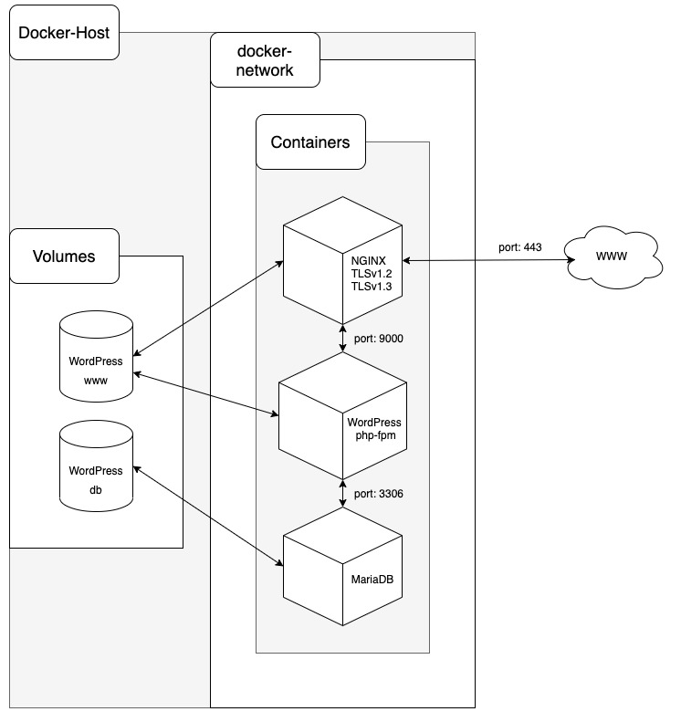

# Inception
Ce projet a pour but d’approfondir vos connaissances en vous faisant utiliser Docker.
Vous allez virtualiser plusieurs images Docker en les créant dans votre nouvelle machine
virtuelle personnelle.

## Mandatory
- [x] Un container Docker contenant NGINX avec TLSv1.2 ou TLSv1.3 uniquement.
- [x] Un container Docker contenant WordPress + php-fpm (installé et configuré) uniquement sans nginx.
- [x]  Un container Docker contenant MariaDB uniquement sans nginx.
- [x]  Un volume contenant votre base de données WordPress.
- [x]  Un second volume contenant les fichiers de votre site WordPress.
- [x]  Un docker-network qui fera le lien entre vos containers.

## Schema

